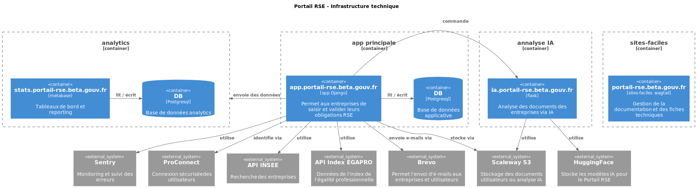

# Infrastructure du Portail RSE

## Diagramme C4

## App principale

L'application principale (`app.portail-rse.beta.gouv.fr`) est développée en Django+Svelte et constitue le cœur du système.
Elle permet aux entreprises de saisir et valider leurs obligations RSE.

L'application s'appuie sur une base de données PostgreSQL pour stocker les données applicatives et s'intègre avec plusieurs services externes :
- l'API INSEE pour la recherche d'entreprises,
- l'API Index EGAPRO pour les données d'égalité professionnelle,
- ProConnect pour l'authentification sécurisée des utilisateurs,
- Scaleway S3 pour le stockage de documents,
- Brevo pour l'envoi d'e-mails, et Sentry pour le monitoring.

Elle commande également le service d'analyse IA et transmet des données à Metabase pour les besoins analytiques.

L'application est actuellement hébérgée chez [Scalingo](https://scalingo.com/fr).

Le code source est disponible ici : https://github.com/betagouv/portail-rse

## Metabase

Basé sur la solution opensource [Metabase](https://www.metabase.com/).

La plateforme analytics (`stats.portail-rse.beta.gouv.fr`) utilise Metabase pour fournir des tableaux de bord et du reporting.

Le système reçoit des données en provenance de l'application principale Django, permettant ainsi de générer des statistiques et des visualisations sur l'utilisation du portail et les données RSE des entreprises.

L'application est actuellement hébérgée chez [Scalingo](https://scalingo.com/fr).

## Service IA

Le service d'analyse par intelligence artificielle (`ia.portail-rse.beta.gouv.fr`) est une application Flask dédiée à l'analyse automatisée des documents des entreprises.

Commandé par l'application Django principale, ce service utilise des modèles d'IA hébergés sur HuggingFace et s'appuie sur Scaleway S3 pour accéder aux documents à analyser.

Il permet d'automatiser l'extraction et l'interprétation d'informations contenues dans les documents soumis par les entreprises.

Le code source est disponible ici : https://github.com/betagouv/portail-rse-externe

L'application est actuellement hébérgée chez [OVH](https://www.ovhcloud.com/fr/).

## Sites-faciles

Le site de documentation (`portail-rse.beta.gouv.fr`) utilise Sites-faciles basé sur Wagtail pour la gestion de contenu.

Cette plateforme héberge la documentation publique et les fiches techniques destinées aux utilisateurs du portail RSE.

L'application est actuellement hébérgée chez [Scalingo](https://scalingo.com/fr).
